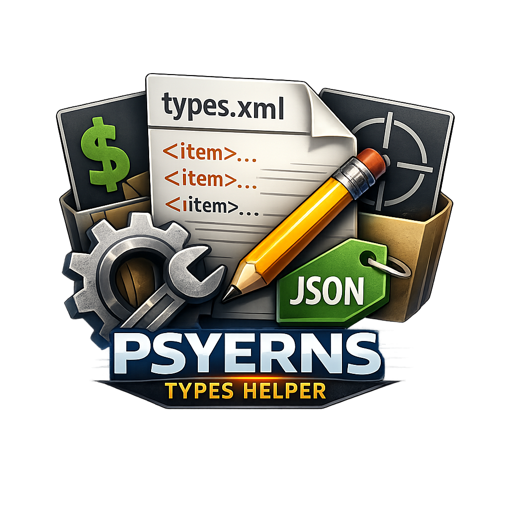

# DayZTypesHelper

<p align="center">
  
</p>

A lightweight **Windows WinForms** helper for editing DayZ `types.xml`, DayZ Expansion **Market JSON** and **Trader JSON** files.

**Author:** Psyern &nbsp;|&nbsp; **Version:** v1.01 &nbsp;|&nbsp; **License:** MIT

---

## Features

### General
- Import classname list from plain text (`.txt`) files.
- Ignore empty lines and comment lines (`#` and `//`) during class import.
- **Import from existing `types.xml`** – loads all classnames and their values, auto-populates Categories, Tags, UsageFlags, ValueFlags.
- **Auto-detect Expansion JSON** – automatically determines Market vs. Trader format on import.
- Searchable classname list.
- **Multi-select classnames** (Ctrl/Shift) for **bulk editing**.
- **Bulk Apply** – apply current editor values to all selected classnames at once.
- Per-class in-memory cache of edits.
- **Undo / Redo** per classname (Ctrl+Z / Ctrl+Y).
- Debounced autosave (500 ms) to selected destination `types.xml`.
- Save on class switch and on app close.
- Export current or all classnames.
- **Dark Mode** toggle with modern dark colour scheme (enabled by default).
- **Robust error handling** for corrupt/invalid XML files.
- Custom app icon.

### Market JSON (DayZ Expansion)
- **Import / Edit / Export Market JSON** files (prices, stock, quantity, attachments, variants).
- **Create new Market JSON** from selected classnames.
- Per-item editing of MaxPriceThreshold, MinPriceThreshold, SellPricePercent, MaxStockThreshold, MinStockThreshold, QuantityPercent, SpawnAttachments, Variants.

### Trader JSON (DayZ Expansion)
- **Import / Edit / Export Trader JSON** files (buy/sell mode per item).
- **Create new Trader JSON** from selected classnames.
- **Trader Tab with dual-list left panel:**
  - **Top list:** Trader Categories (e.g. `Helmets:1`, `Ammo:0`) – loaded from the Trader JSON.
  - **Bottom list:** Available Market JSON files from a scanned folder.
- **Drag & Drop** Market files from the bottom list into Trader Categories to add them.
- **➕ Add / ➖ Remove Category** buttons for manual category management.
- **"Set" button** next to Buy/Sell Mode dropdown – select a category, choose a mode, click **Set** to apply that Buy/Sell Mode to all items belonging to that category (reads classnames from the corresponding Market JSON file).
- Buy/Sell modes: `0` = Buy only, `1` = Buy + Sell, `2` = Sell only, `3` = Hidden / Attachment.
- Trader metadata editing: DisplayName, TraderIcon, Currencies.
- **📂 Load Market files from Categories** – scan a folder for all `.json` files to populate the available files list.
- Safe persist logic – file is only written when actual changes exist, preventing data loss during UI event cascades.

---

## Tech Stack

| Layer | Technology |
|-------|-----------|
| Runtime | .NET 9 (`net9.0-windows`, `win-x64`) |
| UI | Windows Forms |
| Language | C# |
| XML | `System.Xml.Linq` |
| JSON | `System.Text.Json` / `System.Text.Json.Nodes` |
| Tests | xUnit 2.7.0 — **47 tests** |
| Dependencies | None (main project) |

---

## Project Structure

```
DayZTypesHelper.sln
LICENSE
README.md
assets/
  icon.ico                       # App icon (ICO)
  icon.png                       # App icon (PNG)
Samples/                         # Sample DayZ config files for testing
DayZTypesHelper/
  DayZTypesHelper.csproj
  Program.cs
  MainForm.cs
  DarkModeHelper.cs
  Models/
    TypeEntry.cs
    MarketItem.cs
    TraderItem.cs
  Services/
    ClassnameListService.cs
    TypesXmlService.cs
    MarketJsonService.cs
    TraderJsonService.cs
    UndoRedoService.cs
DayZTypesHelper.Tests/
  DayZTypesHelper.Tests.csproj
  ClassnameListServiceTests.cs
  TypesXmlServiceTests.cs
  TypeEntryTests.cs
  TraderItemTests.cs
  TraderJsonServiceTests.cs
  UndoRedoServiceTests.cs
```

---

## Build & Run (Windows)

### Prerequisites

- [.NET 9 SDK](https://dotnet.microsoft.com/download/dotnet/9.0)

### Build & Run

```bash
dotnet build DayZTypesHelper.sln
dotnet run --project DayZTypesHelper/DayZTypesHelper.csproj
```

### Publish as standalone EXE

```bash
dotnet publish DayZTypesHelper/DayZTypesHelper.csproj -c Release -r win-x64 --self-contained -o publish
```

This creates a single `DayZTypesHelper.exe` that runs on any Windows 64-bit PC without needing .NET installed.

---

## Running Tests

```bash
dotnet test DayZTypesHelper.sln
```

All **47 tests** should pass.

---

## Quick Manual Test Checklist

1. **Import Classnamelist**
   - Ensure classes are loaded, sorted, and searchable.
2. **Import types.xml**
   - Click "Import types.xml" to load classnames + values from an existing file.
3. **Select destination types.xml**
   - Use existing or new destination file.
4. **Edit values**
   - Modify numeric fields / flags / list selections.
   - Switch class and verify values persist.
5. **Multi-select & Bulk Apply**
   - Select multiple classes (Ctrl+Click), edit values, click "Bulk Apply".
6. **Undo / Redo**
   - Make changes, press Ctrl+Z to undo, Ctrl+Y to redo.
7. **Validation**
   - `quantmin` / `quantmax` must be `-1` or `1..100`.
   - MinPriceThreshold ≤ MaxPriceThreshold (auto-clamped).
   - MinStockThreshold ≤ MaxStockThreshold (auto-clamped).
8. **Autosave / Export**
   - Wait ~500 ms after edit and verify autosave.
   - Use **Export now** and verify write.
9. **Market JSON**
   - Import Market JSON, edit prices/stock, export to destination.
   - Create new Market JSON from selected classnames.
10. **Trader JSON**
    - Import Trader JSON, verify metadata (DisplayName, TraderIcon, Currencies) is populated.
    - Left list should show Trader Categories when Trader tab is active.
    - Click "📂 Load Market files from Categories" to scan a folder → bottom list shows available `.json` files.
    - Drag a file from the bottom list to the top list → category is added (e.g. `Helmets:1`).
    - Select a category, choose a Buy/Sell Mode, click **Set** → mode is applied to all items from that category's Market JSON.
    - Use ➕ Add / ➖ Remove buttons to manage categories manually.
    - Change Buy/Sell Mode dropdown without selecting a category → applies to ALL items.
    - Create new Trader JSON from selected classnames.
    - Buy/Sell modes: `0` = Buy only, `1` = Buy + Sell, `2` = Sell only, `3` = Hidden/Attachment.
11. **Dark Mode**
    - Toggle "Dark Mode" checkbox to switch theme.
12. **Close app**
    - Verify latest valid edits persist.
13. **Corrupt XML**
    - Try loading a corrupt XML file – expect a clear error message.

---

## Notes

- This tool targets **Windows only** (`net9.0-windows`).
- If no destination is selected, autosave / export-to-file is skipped.
- Dark Mode is enabled by default.

---

## License

This project is licensed under the [MIT License](LICENSE).
